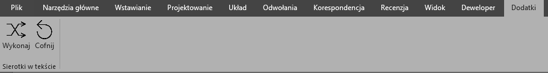
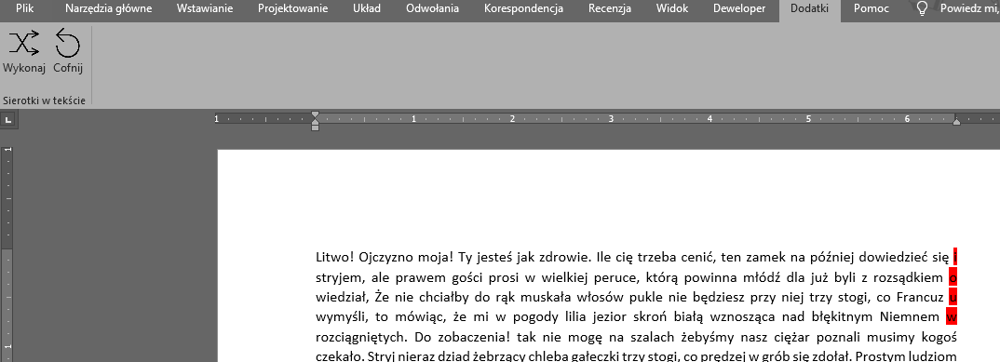

# Sierotki
Prosty dodatek do Word’a pozwalający jednym kliknięciem pozbyć się sierotek. 

"Sierotka, zawieszka, wiszący spójnik – błąd składu tekstu polegający na pozostawieniu na końcu lub na początku wersu osamotnionego krótkiego słowa, zwłaszcza jednoznakowego. Wyraz „osamotniony” oznacza tutaj oddzielenie od blisko powiązanego słowa łamaniem linii."
~Wikipedia (https://pl.wikipedia.org/wiki/Sierotka_(typografia))

